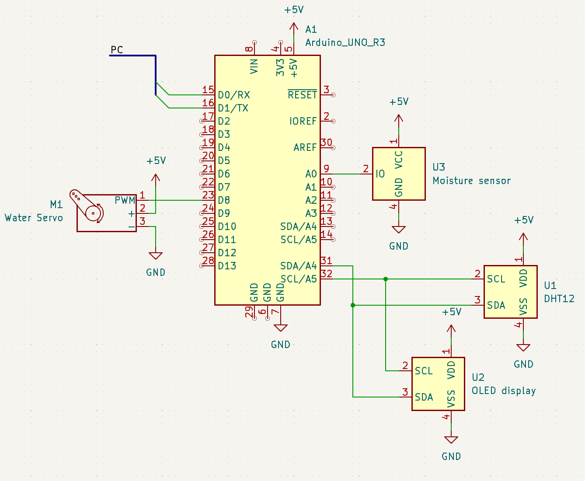
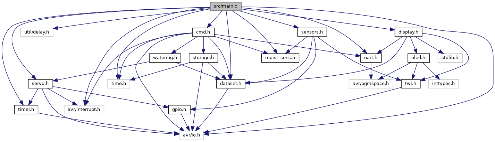
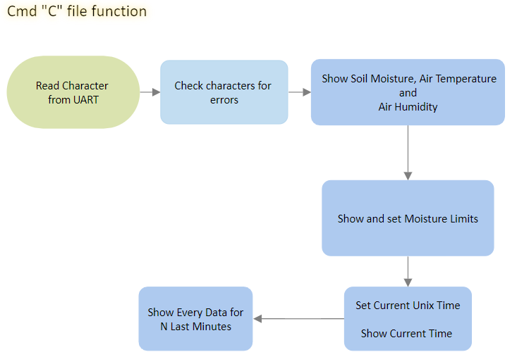
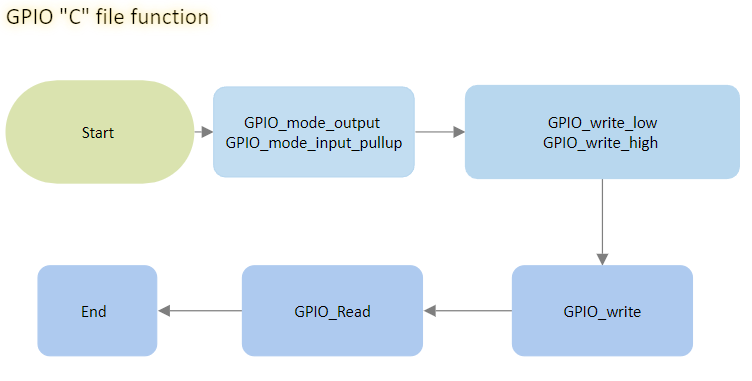

### Členové týmu

* Michal Hanus (Odpovědný za funkci serva a EEPROM a za spojení jednotlivých kódů do sebe)
* Erik Maděránek (Odpovědný za EEPROM a za vývojové diagramy)
* Martin Mihulka (Odpovědný za funkci senzoru vlhkosti a příkazů pro ovládání programu)
* Vít Walach (Odpovědný za funkce LCD a senzoru teploty a vlhkosti vzduchu)

## Teoretický popis a vysvětlení problematiky

Program řeší automatické zalévání květin. Pomocí kapacitního senzoru je měřena vlhkost půdy. Pomocí teploměru a vlhkoměru DHT12 je měřena teplota a vlhkost vzduchu.

Pomocí serva je otáčena trubička s vodu, která po otočení začne zalévat květinu. Servo povolí zalévání pokud vlhkost půdy klesne pod určitou hodnotu a skončí zalévání pokud se hodnota vlhkosti půdy dostane nad určitou hodnotu. Tyto hodnoty lze definovat pomocí příkazové řádky.

Pomocí příkazové řádky lze vypsat teplota a vlhkost ovzduší, vlhkost půdy a čas. Také lze pomocí příkazu vyvolat pomocné menu, ve kterém jsou napsány všechny příkazy.

Každou minutu ukládá program data ze senzorů do paměti EEPROM. Tyto hodnoty lze uložit do CSV souboru a nebo zobrazit v příkazové řádce.

## Popis zapojení Arduina se senzory

Na analogový pin A0 je připojen senzor vlhkosti půdy. Přes sběrnici I2C tedy piny SDA/A4 a SCL/A5 je připojen OLED displej a senzor teploty a vlhkosti vzduchu. Pomocí digitálního pinu D8 je připojeno servo pro ovládání zalévání. Počítač je k Arduinu připojen pomocí pinů D0/RX a D1/TX, které zajišťují komunikaci s Arduinem pomocí příkazové řádky.

##### Schéma zapojení

## Popis programu

#### Kód main.c
[main.c](src/src/main.c)

#### Kód cmd.c
[cmd.c](src/lib/cmd/cmd.c)
[cmd.h](src/lib/cmd/cmd.h)

#### Kód display.c
[display.c](src/lib/display/display.c)
[display.h](src/lib/display/display.h)

#### Kód gpio.c
[gpio.c](src/lib/gpio/gpio.c)
[gpio.h](src/lib/gpio/gpio.h)

#### Kód moist_sens.c
[moist_sens.c](src/lib/moist_sens/moist_sens.c)
[moist_sens.h](src/lib/moist_sens/moist_sens.h)

#### Kód oled.c
[oled.c](src/lib/oled/oled.c)
[oled.h](src/lib/oled/oled.h)
[font.h](src/lib/oled/font.h)

#### Kód sensors.c
[sensors.c](src/lib/sensors/sensors.c)
[sensors.h](src/lib/sensors/sensors.h)

#### Kód servo.c
[servo.c](src/lib/servo/servo.c)
[servo.h](src/lib/servo/servo.h)

#### Kód storage.c
[storage.c](src/lib/storage/storage.c)
[storage.h](src/lib/storage/storage.h)

#### Kód twi.c
[twi.c](src/lib/twi/twi.c)
[twi.h](src/lib/twi/twi.h)

#### Kód uart.c
[uart.c](src/lib/uart/uart.c)
[uart.h](src/lib/uart/uart.h)

#### Kód watering.c
[watering.c](src/lib/watering/watering.c)
[watering.h](src/lib/watering/watering.h)

#### Kód dataset.h
[dataset.h](src/lib/dataset/dataset.h)

#### Kód timer.h
[timer.h](src/lib/timer/timer.h)

## Manuál k použití

Ke správnému fungování celého systému umistěte senzory do květináče. Senzor vlhkosti do půdy a senzor, snímající teplotu a vlhkost vzduchu DHT12, umístit na vnější okraj květináče. Při manipulování, dbejte doporučení výrobce. Dále umistěte v blízkosti květináče nádobu s vodou a servo. To udělejte tak, aby při spuštění serva vytékala voda z nádoby do květináče.

Po spuštění programu, se monitoruje tento stav v květináči a dává příkazy k zavlažování, pokud je zapotřebí. Servo svolí k zalévání, pokud vlhkost půdy klesne pod určitou hodnotu. Zalévání skončí, pokud se hodnota vlhkosti půdy dostane nad určitou hodnotu. Uživatel může upravit hodnoty dle náročnosti pěstované květiny a to pomocí příkazového řádku. Systém monitoruje teplotu a vlhkost ovzduší a pomocí příkazového řádku lze vypsat aktuální data.

Dále je možné vyvolat pomocné menu, ve kterém je sepsán list všech příkazů. Každou minutu ukládá program data ze senzorů do paměti EEPROM. Tyto hodnoty lze uložit do CSV souboru a nebo zobrazit v příkazovém řádku.

## Zdroje

1. Learning material from Digital electronics 2 course.
2. Libraries from [Digital-Electronics-2](https://github.com/tomas-fryza/digital-electronics-2) GitHub repository created by doc. Ing. Tomas Fryza Ph.D.
3. OLED displays with SSD1306 or SH1106 controler created by [Sylaina](https://github.com/Sylaina/oled-display) and slightly modified by Tomas Fryza
