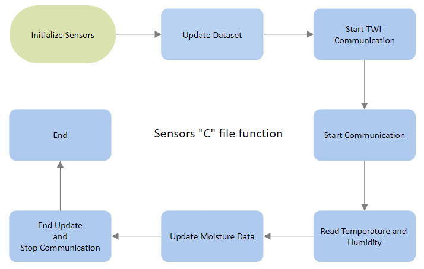

### Členové týmu

* Michal Hanus (Odpovědný za funkci serva a EEPROM a za spojení jednotlivých kódů do sebe)
* Erik Maděránek (Odpovědný za EEPROM)
* Martin Mihulka (Odpovědný za funkci senzoru vlhkosti a příkazů pro ovládání programu)
* Vít Walach (Odpovědný za funkce LCD a senzoru teploty a vlhkosti vzduchu)

## Teoretický popis a vysvětlení problematiky

!!!!!!!!!!!!!Enter a description of the problem and how to solve it.!!!!!!!!!!!!!!!!

## Hardware description of demo application

Insert descriptive text and schematic(s) of your implementation.

## Popis programu
#### Kód main.c
[main.c](src/src/main.c)

#### Kód cmd.c
[cmd.c](src/lib/cmd/cmd.c)
[cmd.h](src/lib/cmd/cmd.h)

#### Kód display.c
[display.c](src/lib/display/display.c)
[display.h](src/lib/display/display.h)

#### Kód moist_sens.c
[moist_sens.c](src/lib/moist_sens/moist_sens.c)
[moist_sens.h](src/lib/moist_sens/moist_sens.h)

#### Kód oled.c
[oled.c](src/lib/oled/oled.c)
[oled.h](src/lib/oled/oled.h)
[font.h](src/lib/oled/font.h)

#### Kód sensors.c
[sensors.c](src/lib/sensors/sensors.c)
[sensors.h](src/lib/sensors/sensors.h)

#### Kód servo.c
[servo.c](src/lib/servo/servo.c)
[servo.h](src/lib/servo/servo.h)

#### Kód storage.c
[storage.c](src/lib/storage/storage.c)
[storage.h](src/lib/storage/storage.h)

#### Kód twi.c
[twi.c](src/lib/twi/twi.c)
[twi.h](src/lib/twi/twi.h)

#### Kód uart.c
[uart.c](src/lib/uart/uart.c)
[uart.h](src/lib/uart/uart.h)

#### Kód watering.c
[watering.c](src/lib/watering/watering.c)
[watering.h](src/lib/watering/watering.h)

## Instructions

Write an instruction manual for your application, including photos and a link to a short app video.

## References

1. Write your text here.
2. ...